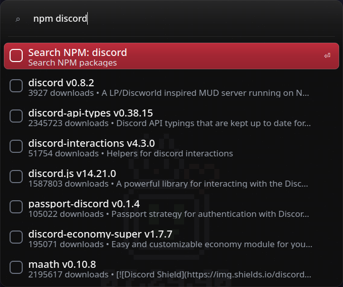

# 🚀 rnux
App launcher made with C++, Qt6 and X11. Made in <6 hours, and inspired by [Raycast](https://raycast.com).
This is very janky right now lmao, don't actually expect it to be bug-free. Probably won't be worked on much, but I'll see, I'll try to work on it whenever im free.

Right now, it's not very mature, because again, **<6 hours of development**, *however* it does have a few nice features:

- It can... launch apps. Truly revolutionary
- It can calculate basic arithmetic operations
- It can search online
- For a few online services (GitHub (`gh`), NPM (`npm`), and Cargo (`cargo`)), it can even fetch the top 10 results and show it without you having to leave
- Caching said results from those online services so it can load """blazing fast (🚀🚀🤯🔫)"""
- It can run a few system commands (like `shutdown`, `lock`, etc.)
- Fuzzy searching

## Showcase

## Structure
All the code is in `src/`
- `src/features` : the features (web search, app launcher, calculator, etc.)
- `src/windowui.cpp` : ui stuff

## Stuff used
- C++17
- CMake
- Qt6
- X11

## Extra stuff
I was bored and watching Youtube and I saw a video in my recommended, which was a showcase of [Raycasts'](https://www.raycast.com/) windows port. This *unfortunately* gave me inspiration to make something similar.
It's an app launcher. It looks good. That's kind of it. Other than that, it is pretty broken and janky.\
**Read more @ [Blog post](https://unium.in/blog/05-7-2025.html)**

#### Oh yeah also....
- This is X11 only! I am too lazy to make it work on Wayland! It will work on Wayland, but the hotkey will not work!